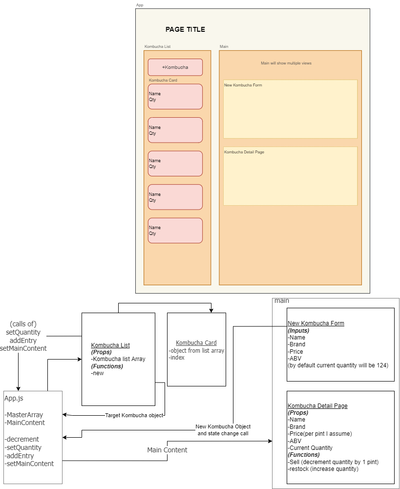

 

  <u><big>|| <b>Tap House</b> ||</big></u>

    <!-- Skylar Avatar/Logo -->
     
    
    

      ___________________________
    

    <!-- GitHub Link -->
    

        <a href="https://github.com/Skylar-Brockbank">
            <strong>Skylar Brockbank's GitHub</strong>
        </a>
    

    

        
    
 
    <!-- Project Shields -->    

  <small>Initiated February 11th, 2022.</small>

## Technologies Used

* HTML
* CSS
* Javascript
* NPM
* React

## Description

A React site to keep track of how many units of Kombucha are availible at a local tap house.

## Setup/Installation Requirements  

* Create and/or navigate to the directory you would like to contain this project on your computer.
* Initialize a git repository by typing git init in the terminal.
* Type git clone https://github.com/Skylar-Brockbank/TapHouse to clone the repository to your local machine.
* Type npm install in the terminal to install all dependencies.  
* Type npm run start into the terminal to start a server displaying the page.

## Known Bugs

No known bugs.

## License

[MIT](https://opensource.org/licenses/MIT)

If you have any issues, questions, ideas or concerns, please reach out to me at my email and/or make a contribution to the code via GitHub.

Copyright (c) 2022 Skylar Brockbank